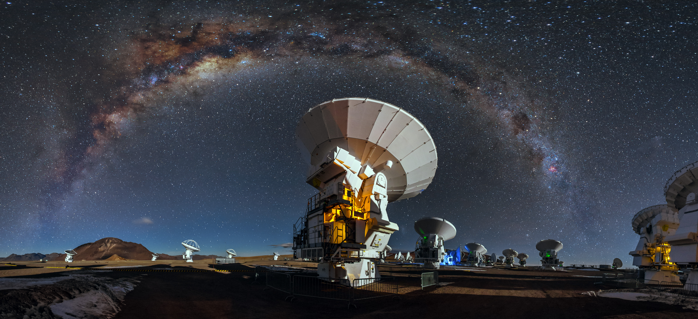

# 🛰️ Astro - Sat Tracking for Astronomers



**Astro** es una herramienta diseñada para astrónomos que permite realizar el **seguimiento en tiempo real y la predicción de órbitas de satélites artificiales**. Su objetivo principal es ayudar a planificar observaciones nocturnas, evitando que el paso de satélites arruine las capturas astrofotográficas o los datos científicos.

---

## 🚀 Características Principales

*   **Seguimiento Preciso:** Cálculo de órbitas usando datos actualizados. 🏗
*   **Geolocalización Automática:** Detecta tu ciudad y coordenadas para un escaneo exacto. ✅
*   **Predicción de Pasos:** Averigua cuántos satélites pasarán sobre tu ubicación en un radio personalizado. ✅
*   **Predicción de Pasos:** Estima la luminosidad de los satelites detectados 🏗
*   **Fácil Integración:** Diseñado con una interfaz limpia y herramientas listas para usar en Python. 🏗

---

## 🛠️ Instalación y Requisitos

Este proyecto requiere **Python 3.8 o superior**. Sigue estos pasos para configurarlo en tu computadora:

1.  **Clona este repositorio:**
    ```bash
    git clone https://github.com/Lu2077/Astro
    cd Astro
    ```

2.  **Crea un entorno virtual (opcional pero recomendado):**
    ```bash
    python -m venv env
    source env/bin/activate  # En Linux/macOS
    # o usa: env\Scripts\activate  # En Windows
    ```

3.  **Instala las dependencias necesarias:**
    ```bash
    pip install -r requirements.txt
    ```

---

## 💻 Ejemplos de Uso en la Terminal

A continuación se muestran ejemplos reales del script en ejecución detectando satélites desde **Santiago de Chile**:

<details>
<summary><b>🔍 Ejemplo 1: Escaneo de Estaciones Espaciales (ISS)</b></summary>

```text
Loaded 21 satellites
Primer satélite en la lista:  ISS (ZARYA)
Detectando tu ubicación actual...

 ¡Ubicación detectada!
Ciudad/Región: Santiago, Santiago Metropolitan, CL
Coordenadas: -33.4569, -70.6483

Escaneando... 21 satélites en un radio de 500 KM

 Resultados: se encontraron 0 satélites cerca de tí ahora mismo
SATELITE                       | DISTANCIA AL PUNTO | COORDENADAS         
---------------------------------------------------------------------------

Process finished with exit code 0
```
</details>

<details>
<summary><b>🛰️ Ejemplo 2: Escaneo de Constelación Starlink (¡19 detectados!)</b></summary>

```text
Loaded 10739 satellites
Primer satélite en la lista:  STARLINK-1008
Detectando tu ubicación actual...

 ¡Ubicación detectada!
Ciudad/Región: Santiago, Santiago Metropolitan, CL
Coordenadas: -33.4569, -70.6483

Escaneando... 10739 satélites en un radio de 500 KM

 Resultados: se encontraron 19 satélites cerca de tí ahora mismo
SATELITE                       | DISTANCIA AL PUNTO | COORDENADAS         
---------------------------------------------------------------------------
STARLINK-30067                 |         170.80 km | -34.627° , -69.446° 
STARLINK-5736                  |         223.24 km | -33.388° , -73.047° 
STARLINK-35514                 |         257.96 km | -32.594° , -68.084° 
STARLINK-30808                 |         263.24 km | -35.830° , -70.663° 
STARLINK-32942                 |         281.70 km | -32.491° , -67.861° 
STARLINK-36947                 |         313.80 km | -30.627° , -70.592° 
STARLINK-30125                 |         333.98 km | -31.782° , -73.606° 
STARLINK-33943                 |         339.57 km | -30.494° , -69.740° 
STARLINK-11567 [DTC]           |         339.98 km | -36.455° , -71.422° 
STARLINK-35618                 |         371.92 km | -33.899° , -74.625° 
STARLINK-32876                 |         379.66 km | -30.420° , -68.792° 
STARLINK-32579                 |         379.70 km | -36.867° , -71.011° 
STARLINK-33919                 |         422.15 km | -32.635° , -66.234° 
STARLINK-32196                 |         461.36 km | -36.531° , -67.243° 
STARLINK-32573                 |         466.81 km | -37.605° , -69.778° 

Process finished with exit code 0
```
</details>

---

## 📂 Estructura del Proyecto

El repositorio cuenta con la siguiente organización de archivos:
*   `Astro/`: Carpeta principal con los scripts y la lógica de seguimiento.
*   `docs/`: Documentación, manuales de usuario e imágenes del proyecto (`Antenas-ALMA-105.jpg`).
*   `requirements.txt`: Lista de librerías externas que necesita el proyecto.
*   `setup.py`: Archivo de configuración para la instalación del módulo.

---

## 🤝 Contribuciones

¡Las contribuciones son muy bienvenidas! Si encuentras un error o tienes una idea para mejorar el proyecto:
1.  Abre un **Issue** explicando el problema.
2.  Crea un **Fork** del repositorio.
3.  Haz tus cambios en una rama nueva y envía un **Pull Request**.

---

## 📄 Licencia

Este proyecto está bajo la Licencia **MIT**.
